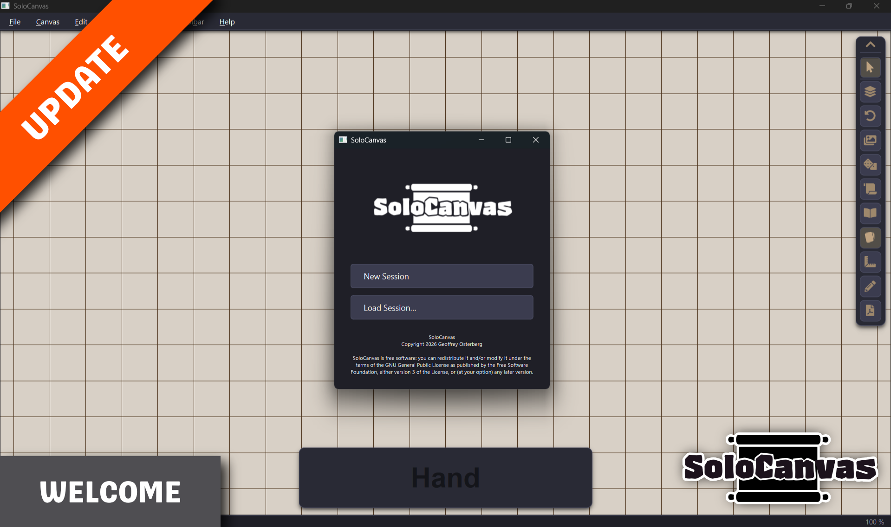
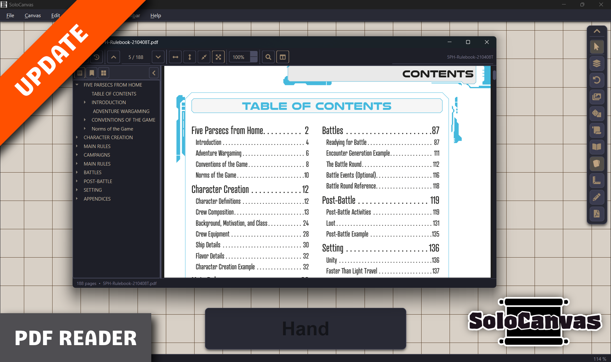
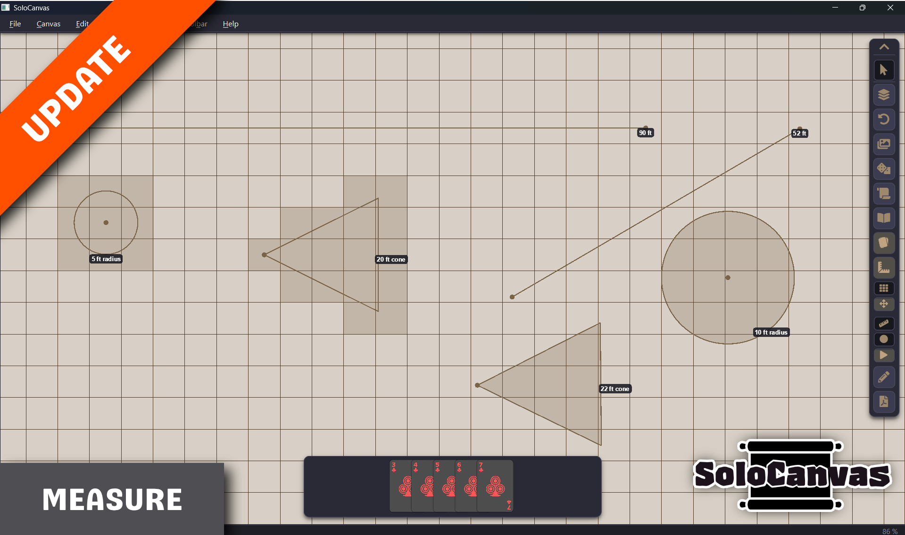
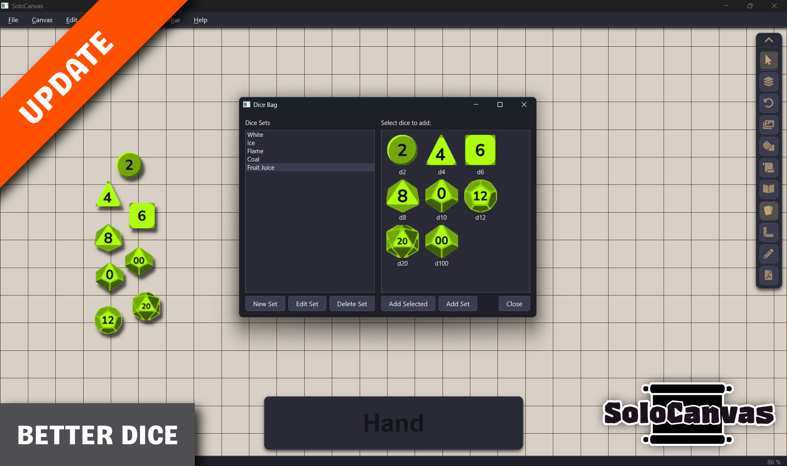
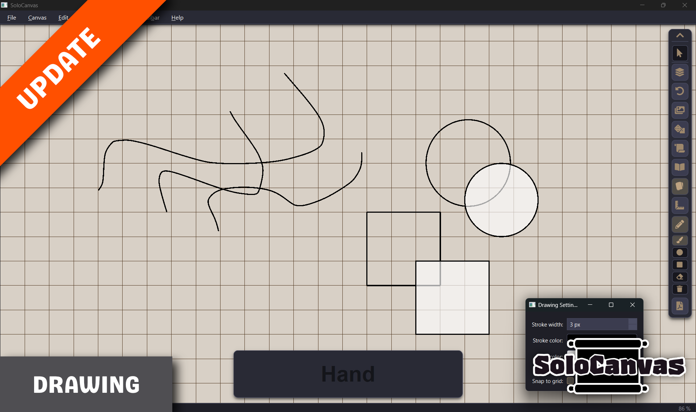

# SoloCanvas

A freeform canvas tool built for solo tabletop RPG players. Place card decks, dice, sticky notes, and images on an infinite canvas, manage your hand, take notes, and save your sessions — all in one window.

**Language:** Python 3 + PyQt6 | **License:** GPL-3.0

---

<table>
  <tr>
    <td colspan="2"></td>
  </tr>
  <tr>
    <td></td>
    <td></td>
  </tr>
  <tr>
    <td></td>
    <td></td>
  </tr>
</table>

---

## System Requirements

- **OS:** Windows 10+, Linux (most distributions), macOS *(untested)*
- **Python:** 3.9 or newer (source installs only)
- **Standalone exe:** Windows 10+ only — no Python required

---

## Installation

### Standalone (Windows)

1. Download the latest release archive from the [Releases](../../releases) page
2. Extract it anywhere on your drive
3. Run **`SoloCanvas.exe`** — keep it in the same folder as your `Decks\`, `Dice\`, `Images\`, and `Notes\` folders

### From Source (Windows / Linux)

1. Clone or download the repository
2. Run the appropriate launch script — it handles everything else automatically:
   - **Windows:** double-click `launch.bat`
   - **Linux:** run `./launch.sh` in a terminal

---

## Launch Scripts

The launch scripts are designed to get SoloCanvas running with no manual setup. On first run they create an isolated Python virtual environment, install all required packages into it, and launch the app. Your system Python installation is never modified.

### `launch.bat` (Windows)

- Searches `PATH` for Python 3, skipping the Windows Store stub
- Creates a `.venv\` folder in the SoloCanvas directory on first run
- Checks for all required packages and offers to install any that are missing
- Installs packages into the virtual environment only — not system-wide
- Launches the app without a terminal window (`pythonw.exe`)

### `launch.sh` (Linux)

- Searches `PATH` for Python 3
- Creates a `.venv/` folder in the SoloCanvas directory on first run
- If `venv` or `pip` support is missing (common on Debian/Ubuntu), detects your package manager and offers to install the required system packages — with an explanation and confirmation prompt before requesting `sudo`
- Supports: `apt` (Debian/Ubuntu), `dnf` (Fedora/RHEL), `pacman` (Arch), `zypper` (openSUSE)
- Installs all Python packages into the virtual environment only
- Pauses on exit so the terminal stays open until you're done

### `build.bat` (Windows — developers only)

Produces a self-contained standalone exe using PyInstaller:

```
dist\SoloCanvas\SoloCanvas.exe
```

- Searches `PATH` for Python 3 dynamically — no hardcoded paths
- Installs PyInstaller if needed
- Bundles all dependencies, fonts, icons, and resources
- Copies `Dice\` and `resources\` next to the exe automatically
- Creates empty `Decks\`, `Images\`, and `Notes\` folders in the output

---

## Features

### Canvas

- **Infinite canvas** — zoom, pan, and arrange anything freely with no boundaries
- **Background theming** — the entire UI (toolbar, hand strip, dialogs) derives its colour from the canvas background colour
- **Grid** — optional dot or line grid with configurable size and snap-to-grid
- **Undo / Redo** — full undo history for canvas actions (`Ctrl+Z` / `Ctrl+Shift+Z`)
- **Drawing tools** — freehand draw and shape tools (line, rectangle, ellipse) with configurable colour, width, and opacity
- **Measurement tool** — drag to measure distances on the canvas with configurable scale and units. Area and cone measurement as well.
- **Mini Map** — floating overview centered on a selcted image item. Good for 
- **Multi-select** — rubber-band select, `Ctrl+A`, or `Ctrl+click`; batch actions (flip, roll, rotate, delete, lock) apply to all eligible selected items with counts shown in context menus
- **PDF Viewer** — open and page through PDF files from the Notepad window

### Cards & Decks

- **Deck Library** — **Image folders** tab: decks from the `Decks\` folder; **Saved custom** tab: decks you stored from the canvas (`Save to Deck Library` on a custom deck), persisted under your SoloCanvas app data; **Add to Canvas** places a fresh copy in the current session
- **Drawing cards** — hover over a deck and press a number key to draw to hand; `Shift`+number draws directly to the canvas
- **Flip** — flip any card or deck face-up / face-down individually or in bulk
- **Shuffle** — shuffle any deck or stack; animates with a shake
- **Card Picker** — search cards by name, drag to reorder the deck, split at a selected card, reset or shuffle order, adjust thumbnail size
- **Card stacking** — select multiple cards and/or decks and stack them into a new deck-like stack (`Ctrl+G`); disband a stack to return cards to their original decks
- **Custom deck** — right-click and choose **Create custom deck…** with several spread cards and/or decks selected, or with **a single stack or deck** selected (uses every card in that pile); builds a normal deck from copies (duplicates allowed); draw, shuffle, search, and return-to-deck all use this deck, not the originals; **Save to Deck Library…** keeps a snapshot in the library’s Saved custom tab for other sessions
- **Spread** — spread a deck's cards horizontally on the canvas (`Ctrl+Shift+G`)
- **Recall** — return canvas cards to their decks via the Recall dialog (`Ctrl+R`)
- **Hand strip** — persistent card hand at the bottom of the window; drag cards to canvas, reorder within hand, multi-select, return to deck

### Dice

- **Dice Bag** — place dice on the canvas from a palette of d4, d6, d8, d10, d12, d20, and dF (Fate/Fudge)
- **Rolling** — press `R` to roll all selected dice; double-click a die to roll it; roll animation plays on each roll
- **Roll Log** — running history of all rolls, updated in real time; accessible from the die context menu
- **Custom dice sets** — load custom dice face images from the `Dice\` folder; manage sets via the Dice Bag

### Images

- **Drag and drop** — drag image files from Explorer or your file manager directly onto the canvas
- **Paste from clipboard** — `Ctrl+V` pastes any image copied from a browser, editor, or file; auto-saved to your local Images folder
- **Image Library** — browse and manage your image collection; Scene tab shows canvas images, Library tab shows all saved images
- **Localise** — copy externally linked images into your local library for portability
- **Anchor** — pin an image flat to the canvas background so it never moves or interferes with other items
- **Hover preview** — hover over any image to see a full-size preview (configurable)
- **Resize** — drag corners to resize; hold Shift to lock aspect ratio
- **Rotate** — `E` / `Q` keys or mousewheel while hovering; configurable rotation step

### Sticky Notes

- **Freeform notes** — place resizable, rotatable sticky notes anywhere on the canvas
- **Customisable appearance** — set note background colour and font colour per note or from the Settings dialog
- **Copy / Paste** — duplicate sticky notes via `Ctrl+C` / `Ctrl+V` or the context menu
- **Lock** — lock a sticky note in place to prevent accidental moves

### Notepad

- **Text formatting** — Bold (`Ctrl+B`), Italic (`Ctrl+I`), Underline (`Ctrl+U`)
- **Font controls** — choose font family and size; settings persist between sessions
- **Multi-file** — open, save, and switch between any number of Markdown files

### Sessions

- **Named sessions** — save and load canvas states with a name of your choice
- **Thumbnail previews** — each session stores a canvas screenshot; the Open Session dialog shows previews at a glance
- **Autosave** — automatically saves on window close; saves to the active session if named, otherwise to a timestamped autosave
- **Session picker** — browse and delete saved sessions from the Open dialog

### Settings

- **Rebindable hotkeys** — every keyboard shortcut can be reassigned from the Settings dialog
- **Canvas** — background colour, grid style (dots / lines), grid size, snap-to-grid toggle
- **Display** — zoom limits, hover preview enable/disable, card dimensions, rotation step
- **Sticky Notes** — default font family, size, font colour, and note colour for new notes
- **Measurement** — scale, units, line style
- **Drawing** — default tool, colour, stroke width, opacity

---

## Hotkeys

All hotkeys are rebindable in **Settings → Hotkeys**. Press `K` at any time to open the in-app hotkey reference.

### Canvas & Navigation

| Key | Action |
|-----|--------|
| Scroll wheel | Zoom in / out |
| `=` / `-` | Zoom in / out |
| `Ctrl+0` | Reset zoom |
| Middle-click drag | Pan |
| Right-click drag | Pan |
| `G` | Toggle grid |
| `H` | Toggle hand strip |
| `M` | Toggle magnify overlay |
| `Escape` | Exit active tool / show startup dialog |

### Selection & Items

| Key | Action |
|-----|--------|
| `Ctrl+A` | Select all |
| `Ctrl+C` | Copy selected |
| `Ctrl+V` | Paste |
| `Delete` | Delete selected |
| `L` | Lock / unlock selected |
| `U` | Send selected to back |
| `E` | Rotate clockwise |
| `Q` | Rotate counter-clockwise |
| `F` | Flip selected cards / decks |

### Cards & Decks

| Key | Action |
|-----|--------|
| `1`–`9` | Draw N cards from hovered deck to hand |
| `R` | Shuffle selected deck(s) |
| `Ctrl+G` | Stack selected cards / decks |
| `Ctrl+Shift+G` | Spread selected deck horizontally |
| `Ctrl+R` | Open Recall dialog |

### Dice

| Key | Action |
|-----|--------|
| `R` | Roll selected dice (simultaneously with shuffle if decks also selected) |
| Double-click | Roll die |

### Tools & Dialogs

| Key | Action |
|-----|--------|
| `N` | Open Notepad |
| `D` | Open Deck Library |
| `I` | Open Image Library |
| `B` | Open Dice Bag |
| `K` | Open Hotkey Reference |
| `Ctrl+N` | New session |
| `Ctrl+S` | Save session |
| `Ctrl+O` | Open session |
| `Ctrl+I` | Import deck |
| `Ctrl+Z` | Undo |
| `Ctrl+Shift+Z` | Redo |

---

## Adding Decks

SoloCanvas loads card decks from the **`Decks\`** folder next to `main.py` (or the exe).

Each deck is a **subfolder** containing card images and a back image:

```
Decks/
  My Deck/
    card_01.png
    card_02.png
    ...
    back.png          ← must contain "back" in the filename
```

Supported formats: `.png`, `.jpg`, `.jpeg`, `.bmp`, `.gif`, `.tiff`, `.webp`

All images whose filename contains `back` become the deck back. All other images become cards.

---

## Folder Structure

```
SoloCanvas/
  main.py             ← entry point
  src/                ← application source
  Decks/              ← card decks (one subfolder per deck)
  Dice/               ← dice SVG assets
  Images/             ← localised image library
  Notes/              ← notepad Markdown files
  launch.bat          ← Windows launch script
  launch.sh           ← Linux launch script
  build.bat           ← Windows PyInstaller build script
  requirements.txt    ← Python dependencies
```

User data (sessions, settings, autosaves) is stored in:
- **Windows:** `%APPDATA%\SoloCanvas\`
- **Linux:** `~/.local/share/SoloCanvas/` *(or equivalent)*

---

## License

SoloCanvas is free software, distributed under the **GNU General Public License v3.0**.

Copyright © 2026 Geoffrey Osterberg

You may redistribute and/or modify it under the terms of the GPL as published by the Free Software Foundation — either version 3 of the License, or (at your option) any later version.

See [LICENSE](LICENSE) or <https://www.gnu.org/licenses/> for the full text.
